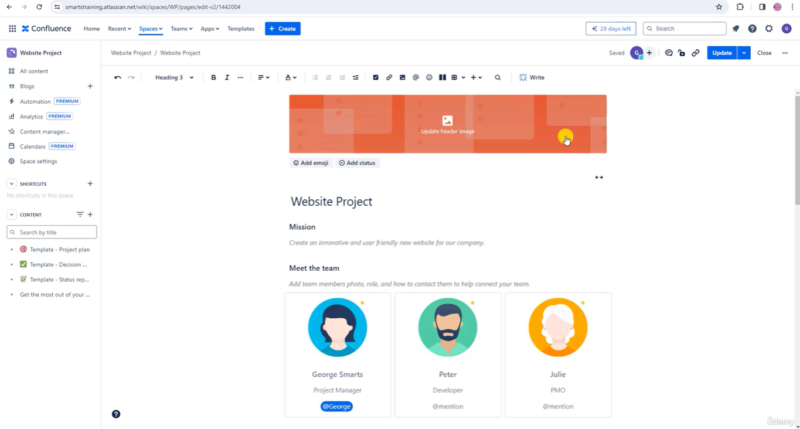
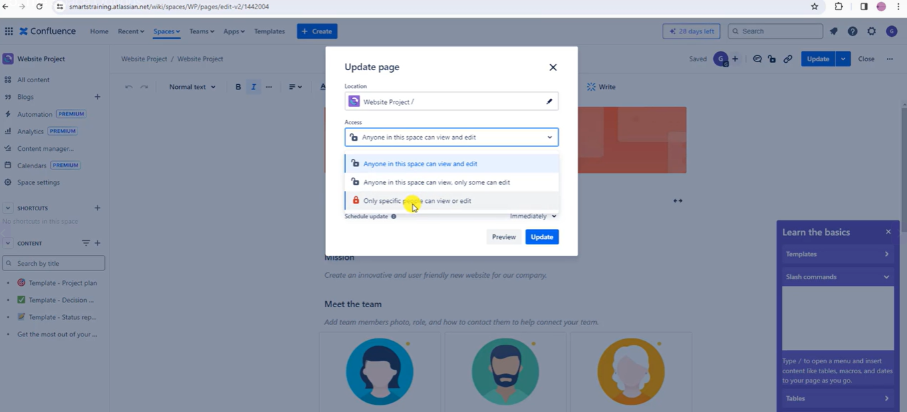
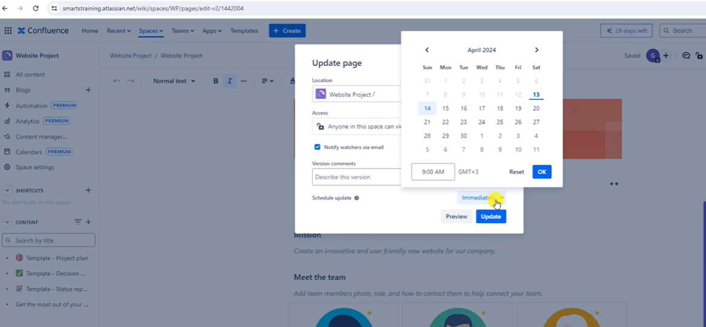
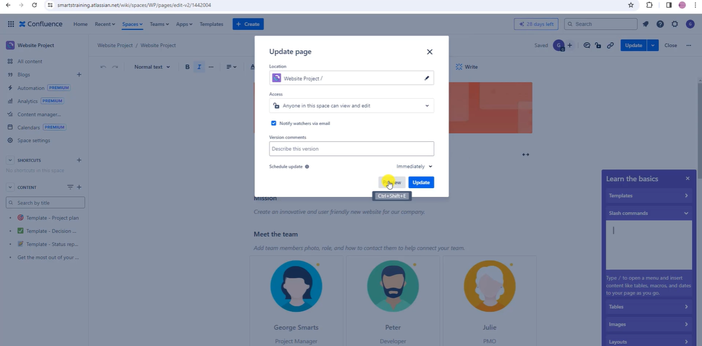
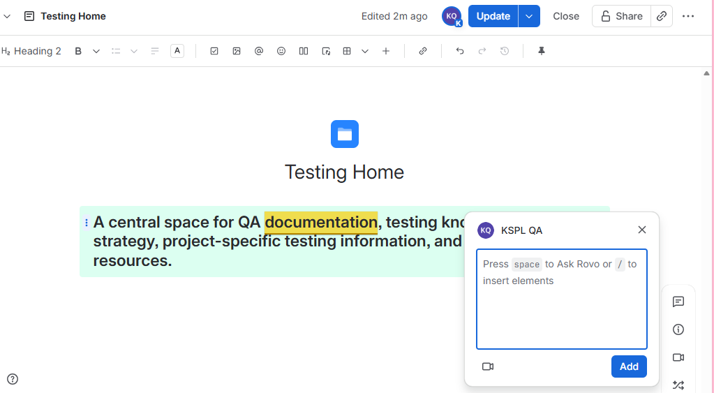
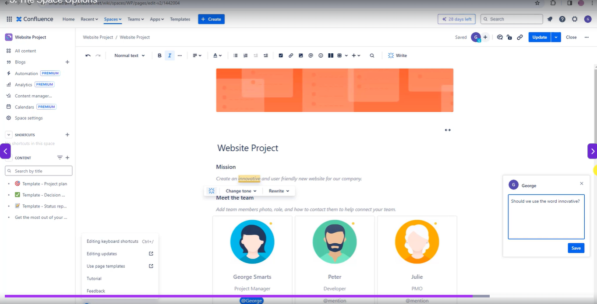
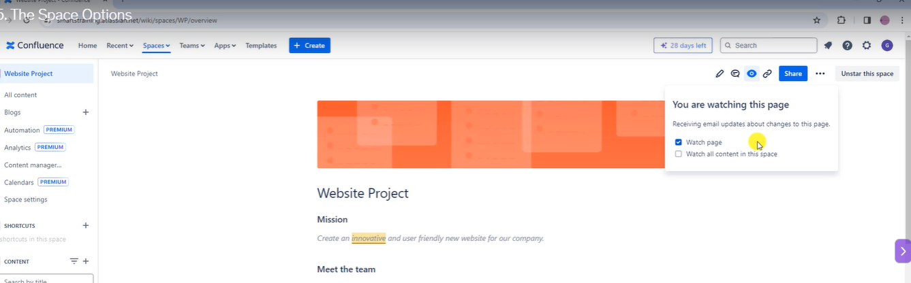

# Confluence

* Confluence pricing - https://www.atlassian.com/software/confluence/pricing

## Confluence Overview and Interface

* Templates

* Search

* Help

* Switch to different apps

## Create a new space

* Star the space , so that it is visible in the space and home

* Space tools

* Automation

* Analytics

* Content manager

* Calendars

* Space settings

* Click on Pencil Icon

* Now you can edit the document

* Update space access settings

* Schedule update

* You can preview it before it goes to production

* You can use inline comments 

> This is esecially useful if you're currently working on a draft and you're collaborating with your team and you want to have a discussion about a specific section of the page and this option here

* You can watch for updates if made any changes.

* User "Copy Link" to share the page with someone