# Confluence

* Confluence pricing - https://www.atlassian.com/software/confluence/pricing

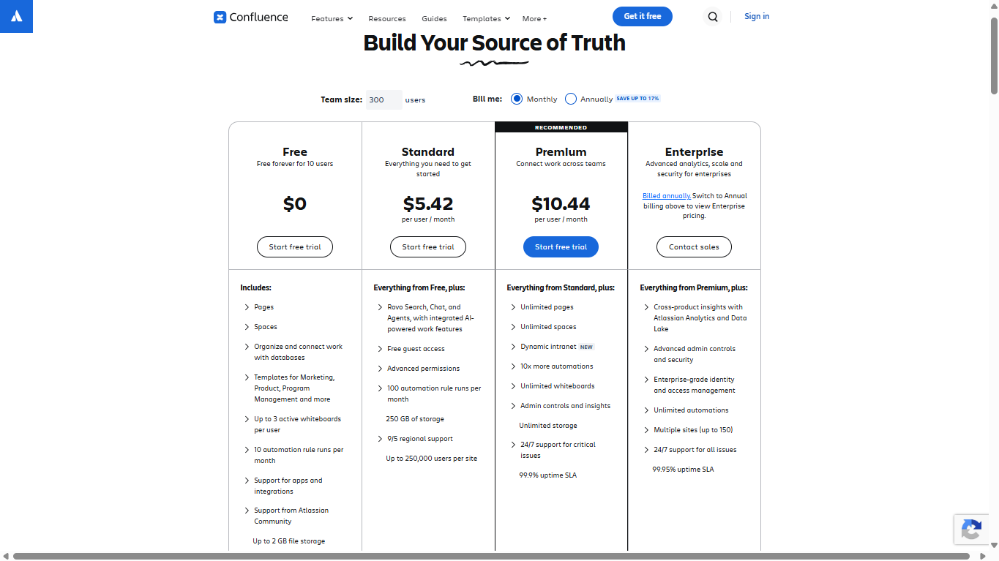

## Confluence Overview and Interface

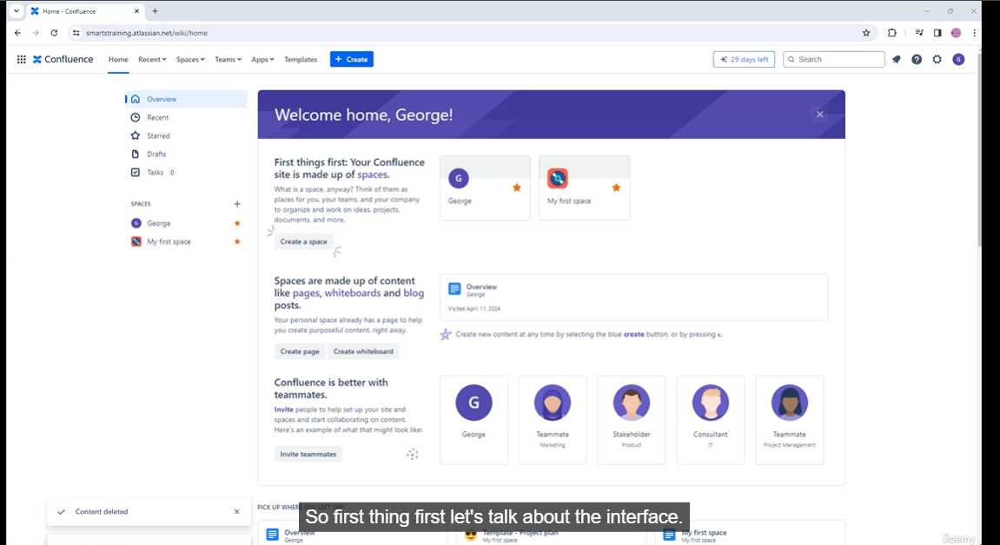

* Templates

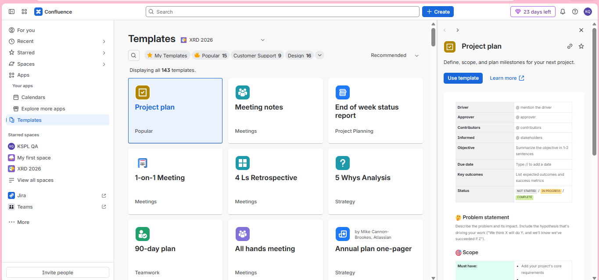

* Search

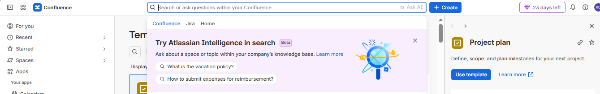

* Help

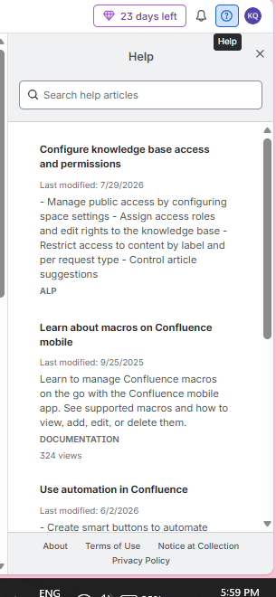

* Switch to different apps

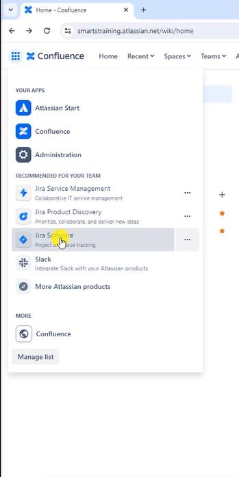

## Create a new space

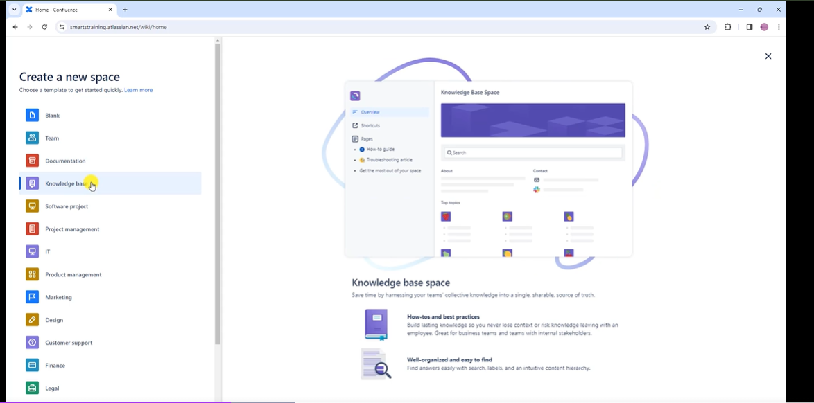

* Star the space , so that it is visible in the space and home

* Space tools

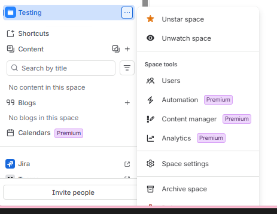

* Automation

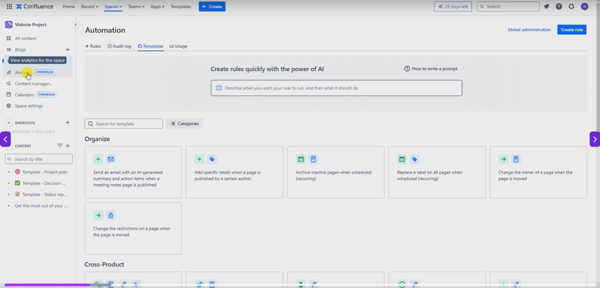

* Analytics

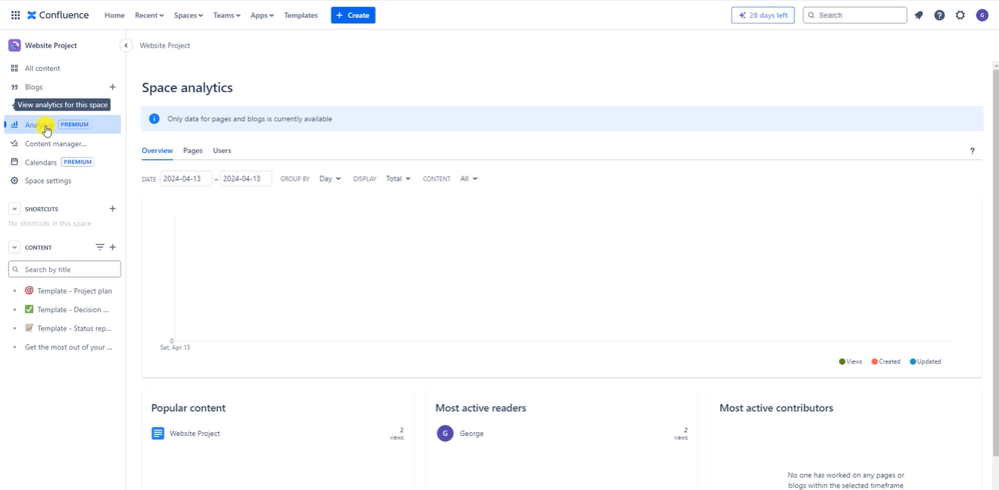

* Content manager

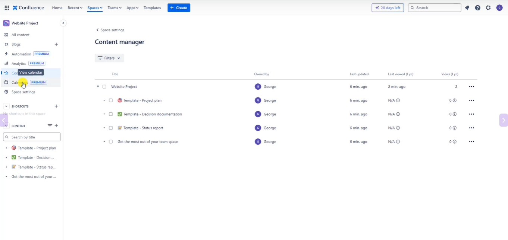

* Calendars

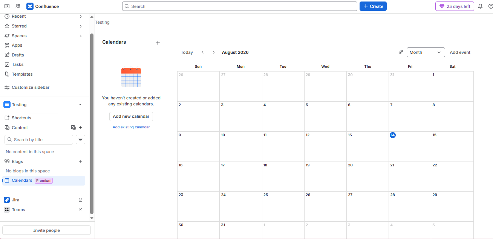

* Space settings

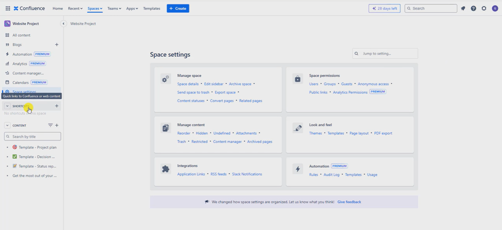

* Click on Pencil Icon

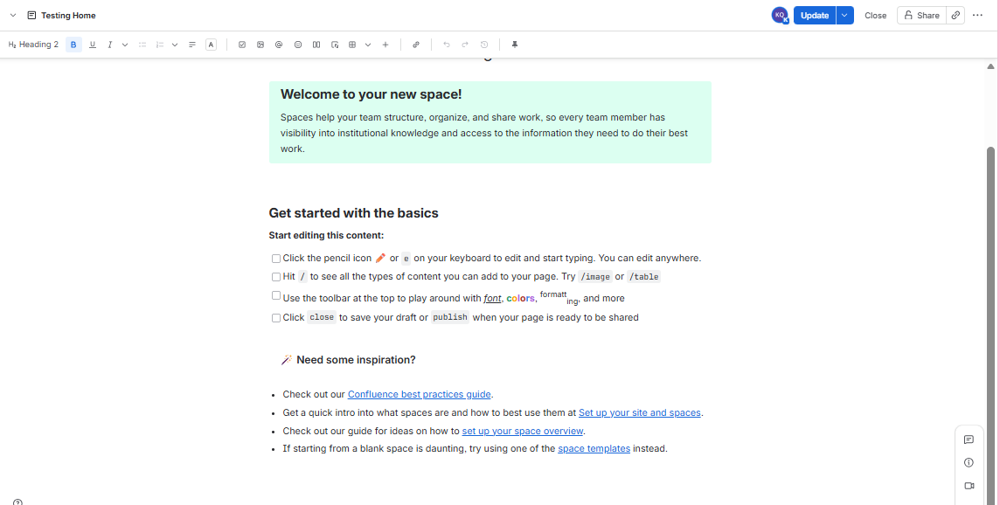