* Create a team

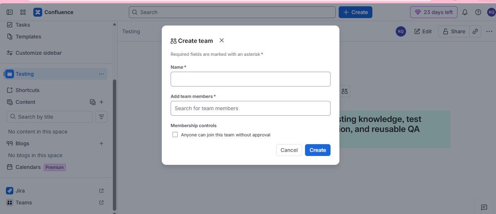

* Invite people to confluence

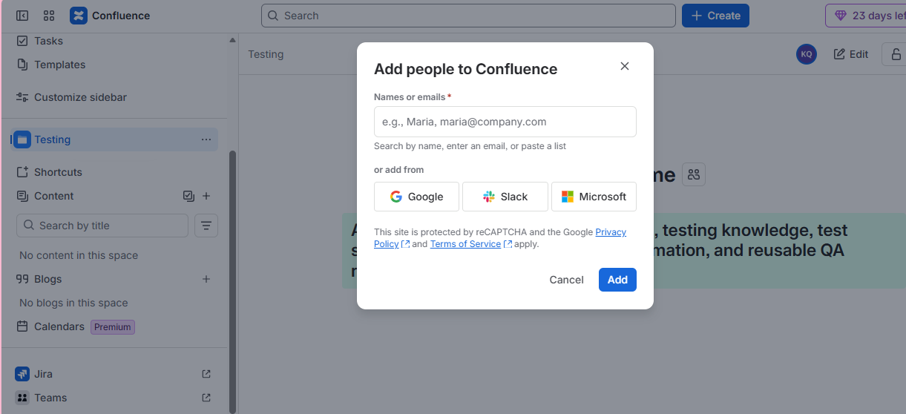

and this is how you add people to your project.

## Working with pages

Add page in the content

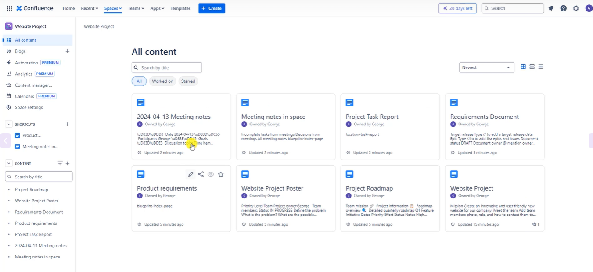

> We created the pages which we need
> So you can create for your own project. Start from blank, or template
> I just choose template in most cases and then amend it
> Or you can also import

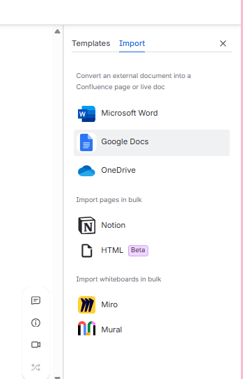

# 8. Working with text - text styles, text formatting, text alignment, color, lists

## 10. Page Layouts

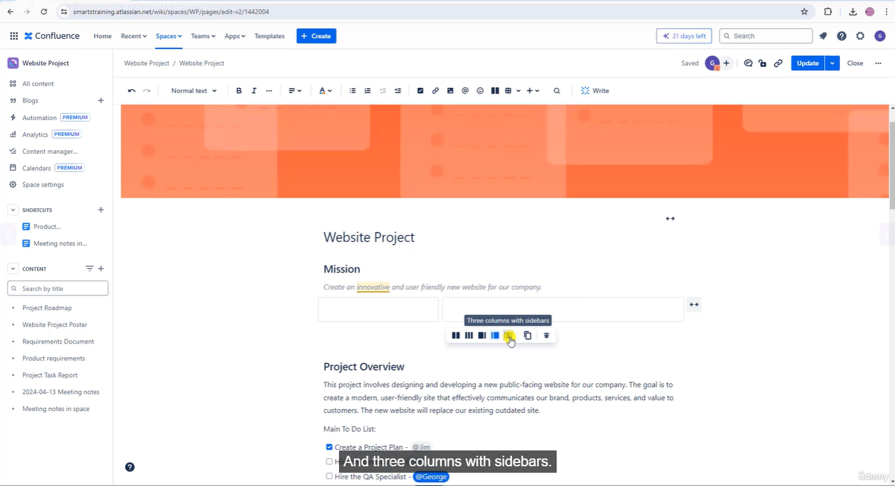

* you can also move the layout

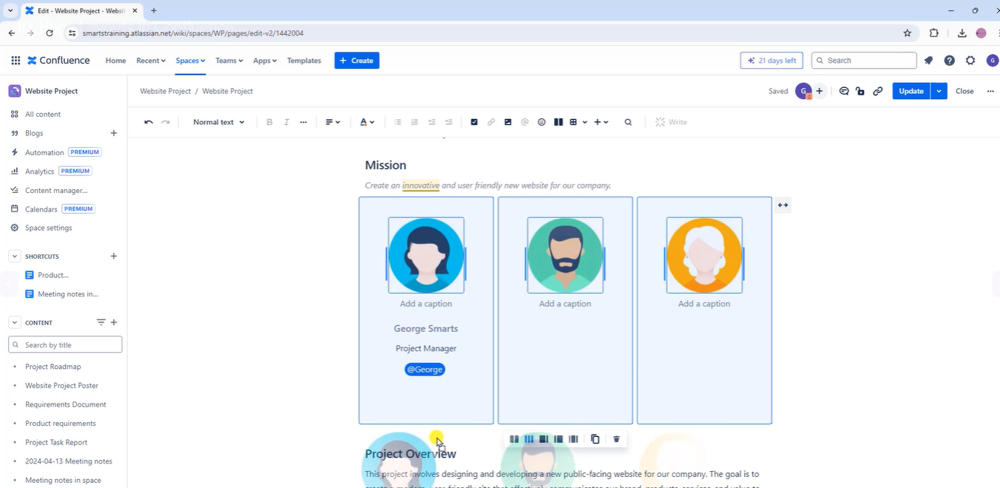

* You can add tables

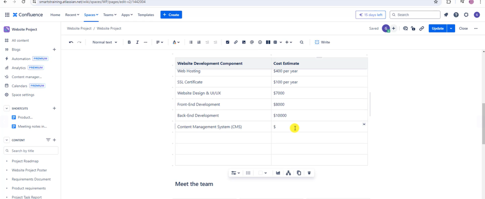

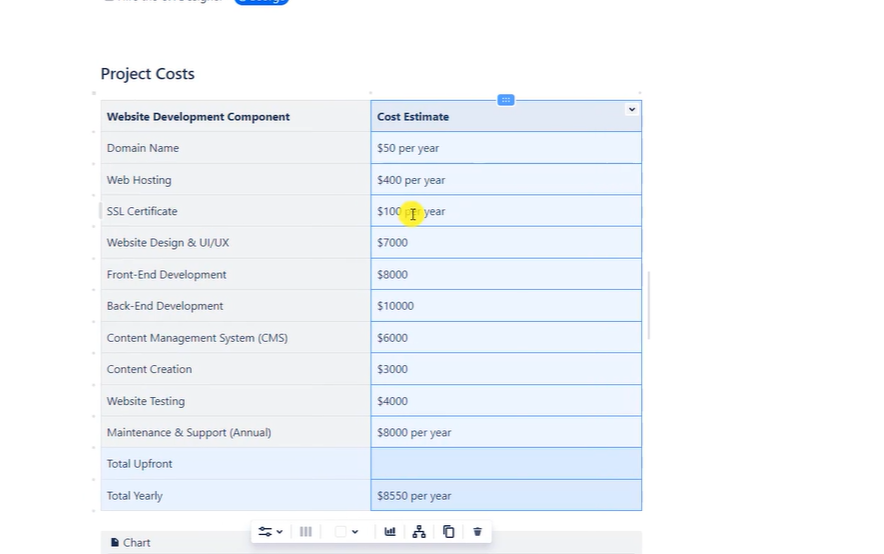

> Tables are great way to represent numeric data

## Charts in Confluence

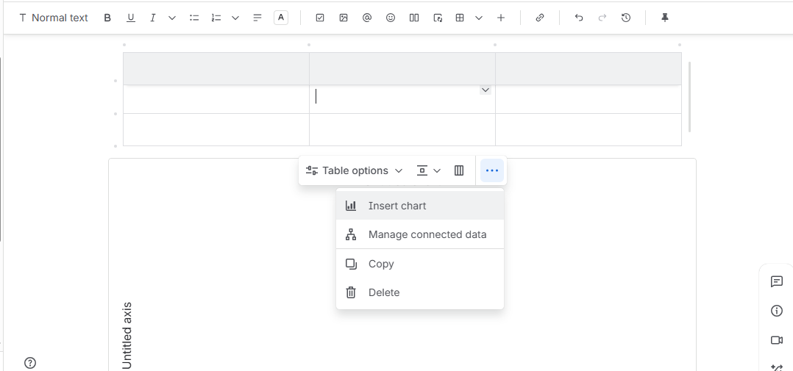

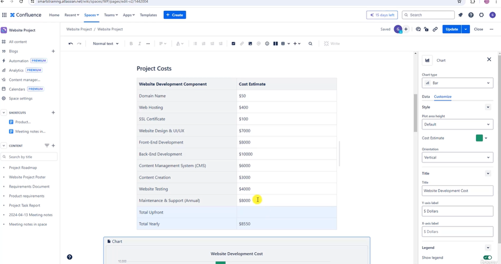

> Charts are great way to represent the data

## Insert Objects

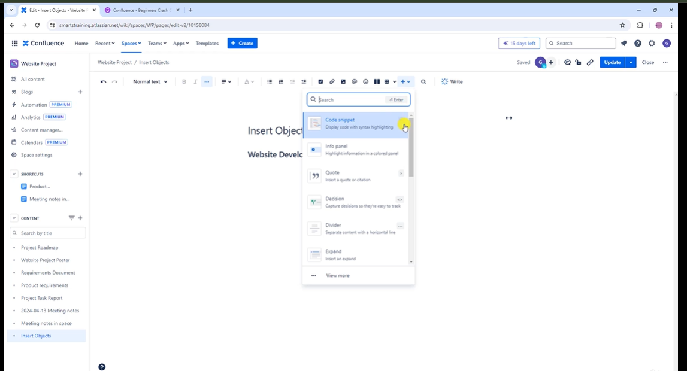

> you can add info panel and decision black

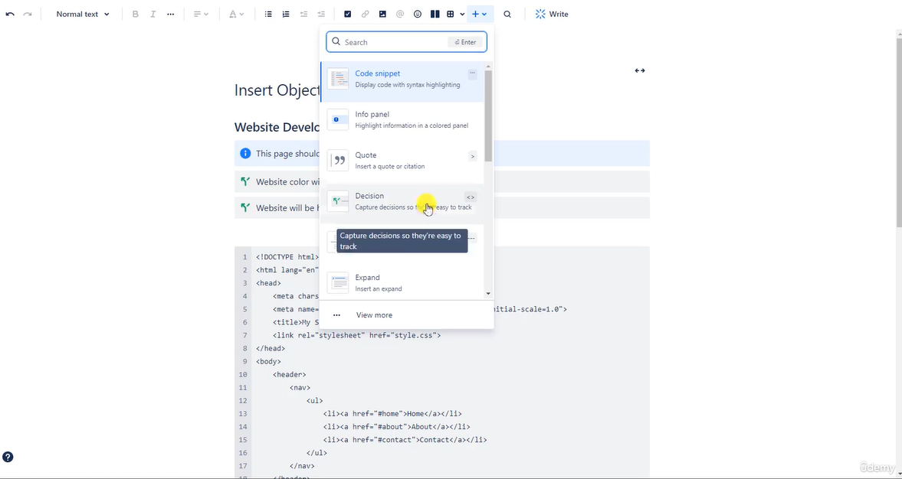

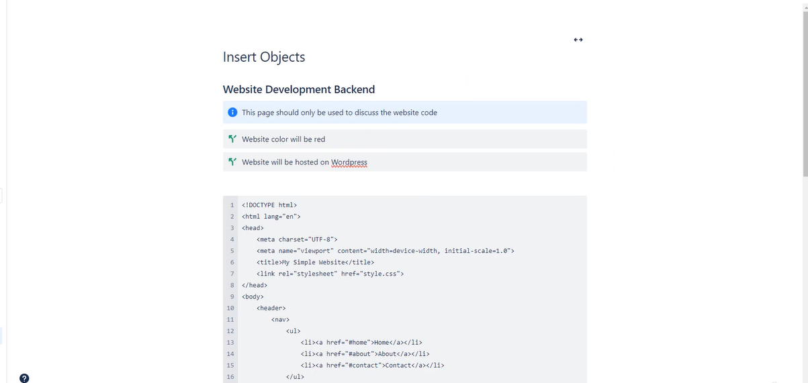

> Use divider to make the section divide logically

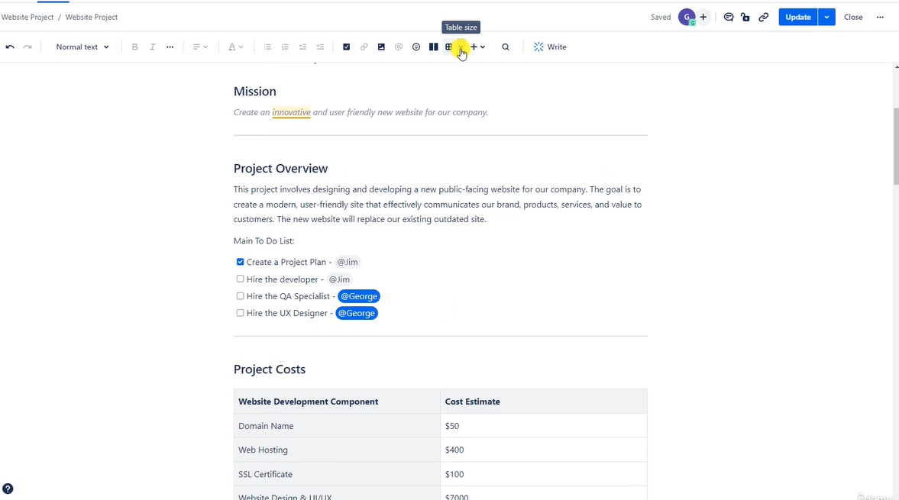

and you have lot more

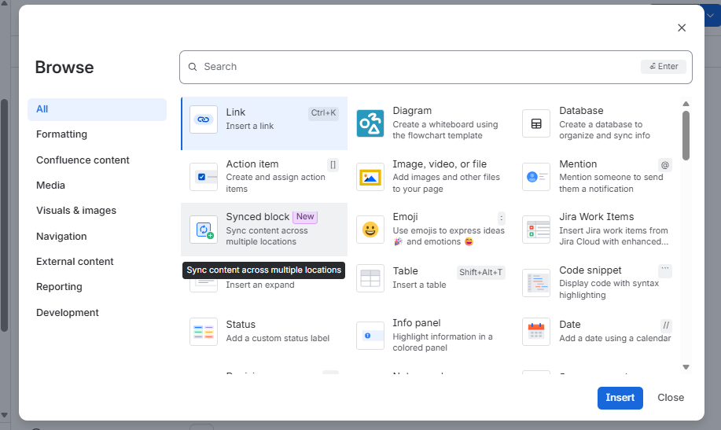

* Explore above and expand your knowledge whats actually possible with confluence and get familiar with it.

## Find and replace

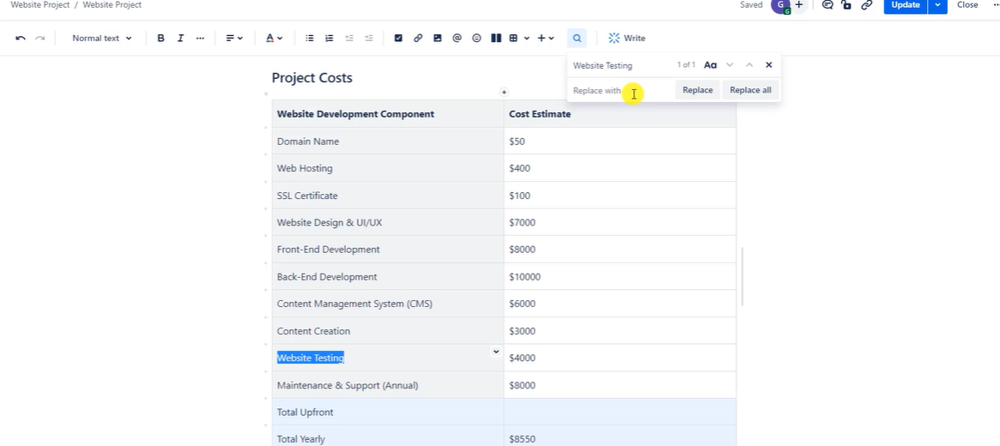