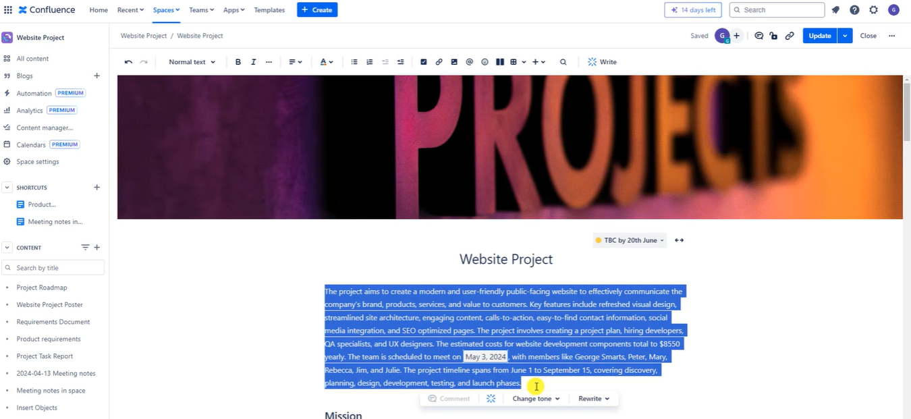
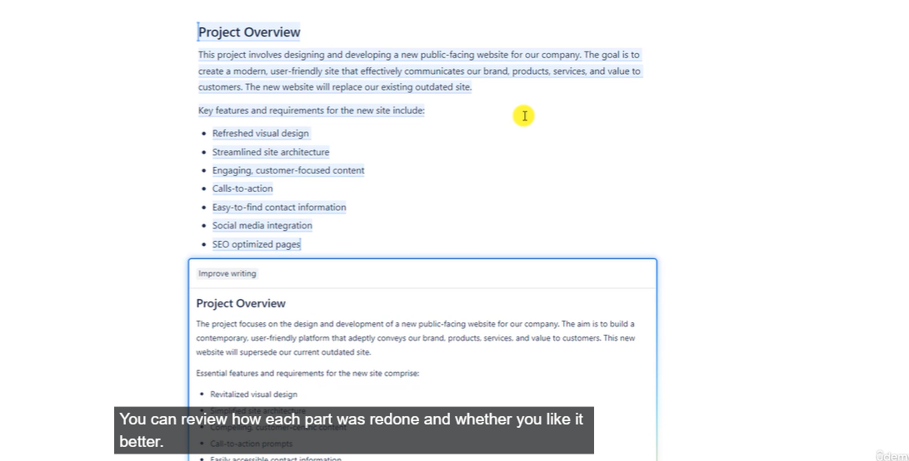
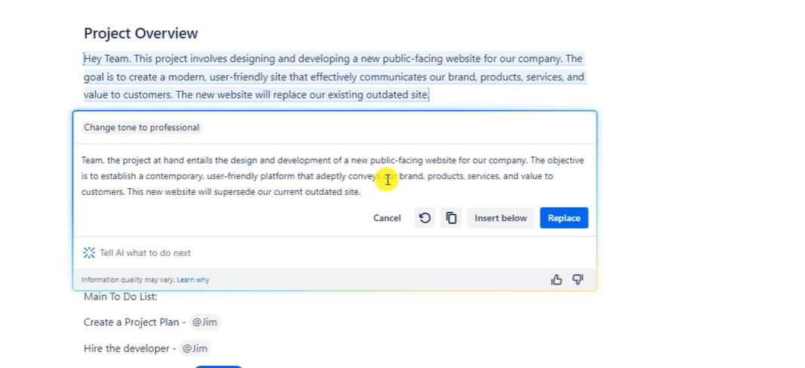
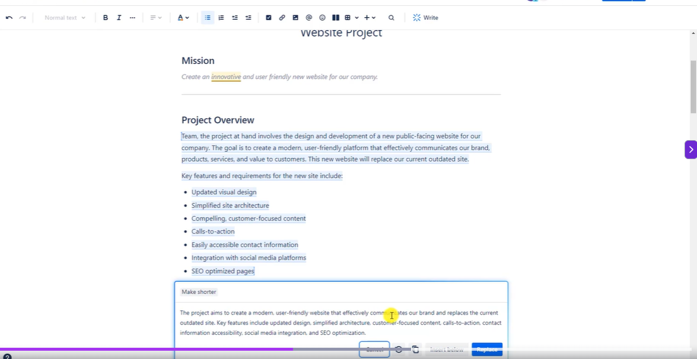
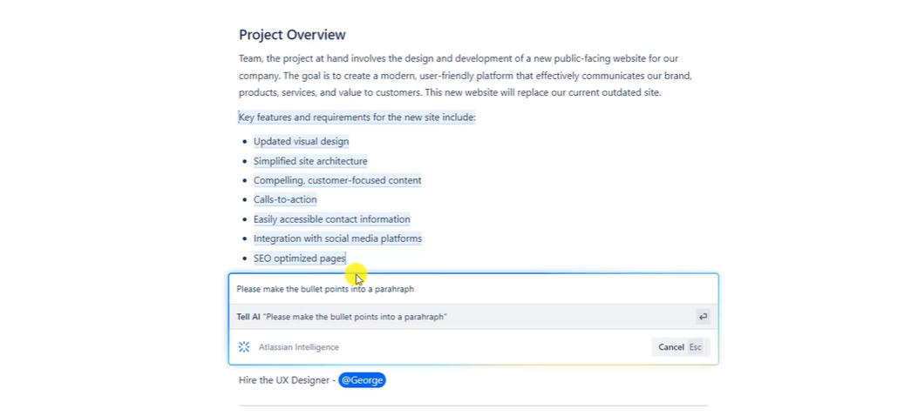

# AI Assitant

> you can write summary

> you can get good ideas even if you are good at writing. you don't have to replace the whole thing.

## Change tone

## Make it shorter

## custom instruction

