## Creating a Project Poster

> We use IT project poster to understand what are the possible solution and really to challenge our assumptions

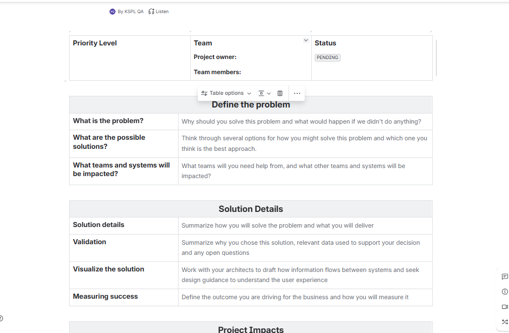

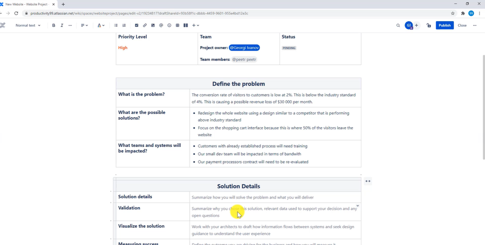

## Creating a Project Roadmap

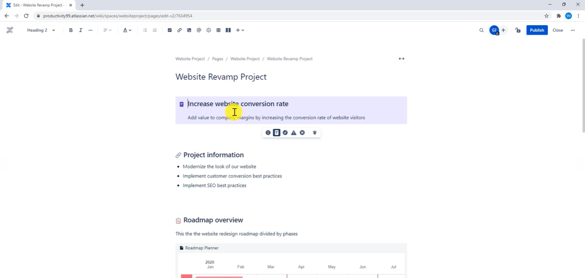

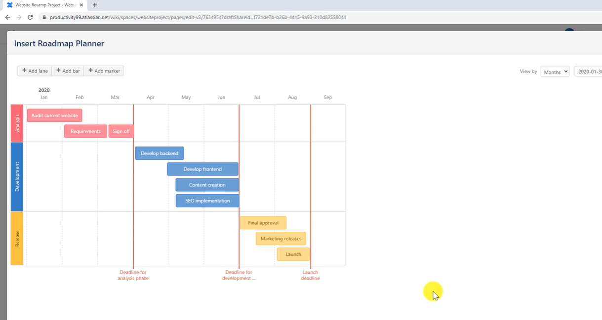

> detailed quarterly roadmap

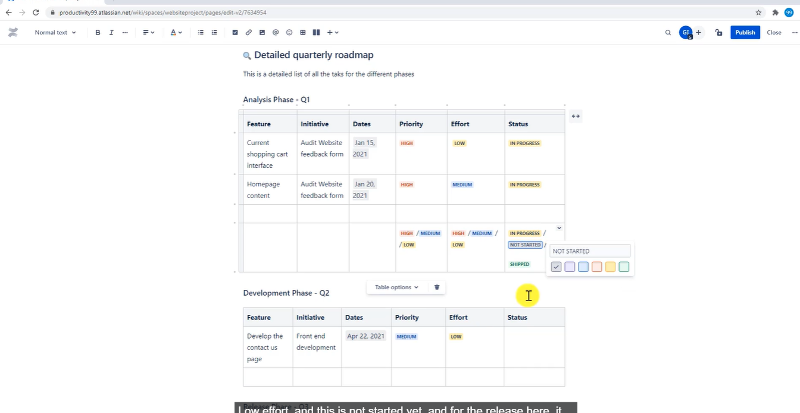

above template is going to give you high level view of your project - in terms of timeline, features

## Requirements Document in Confluence

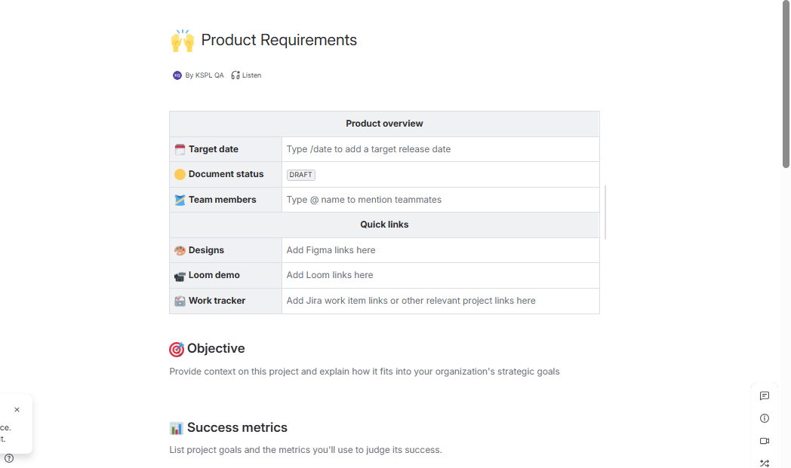

you can also link Jira to confluence

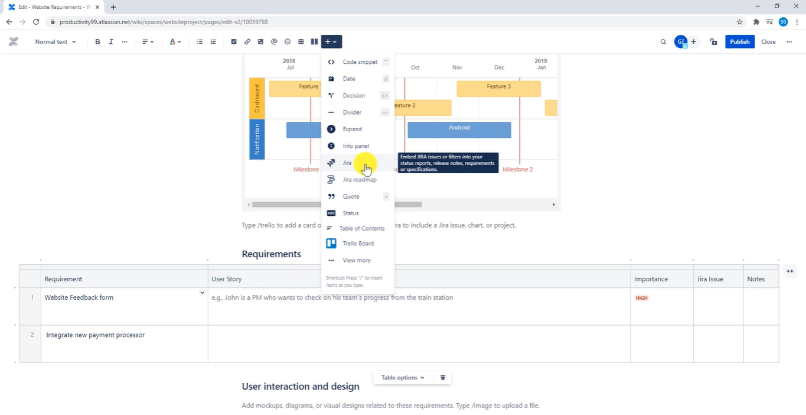

> We have options for open questions

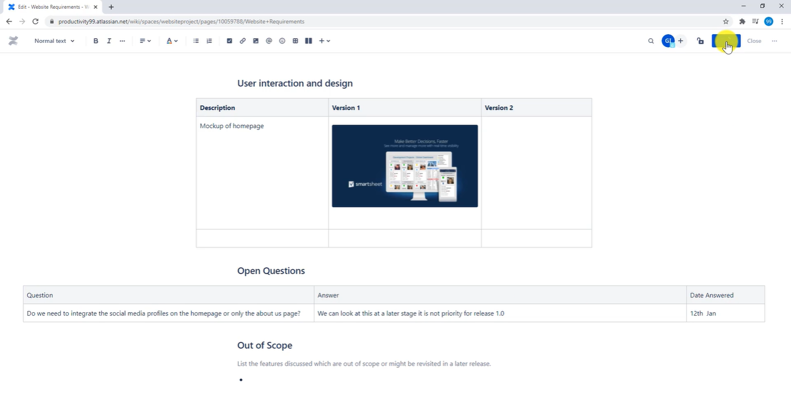

## Task Report

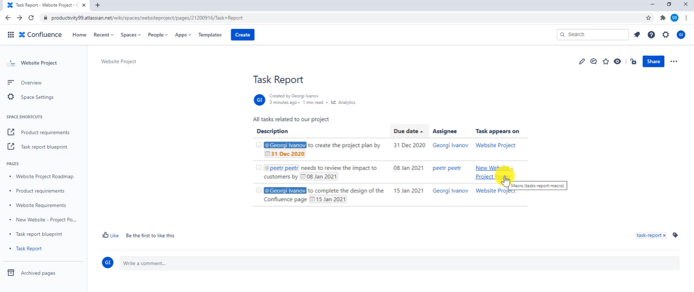

## capturing action items from team meetings

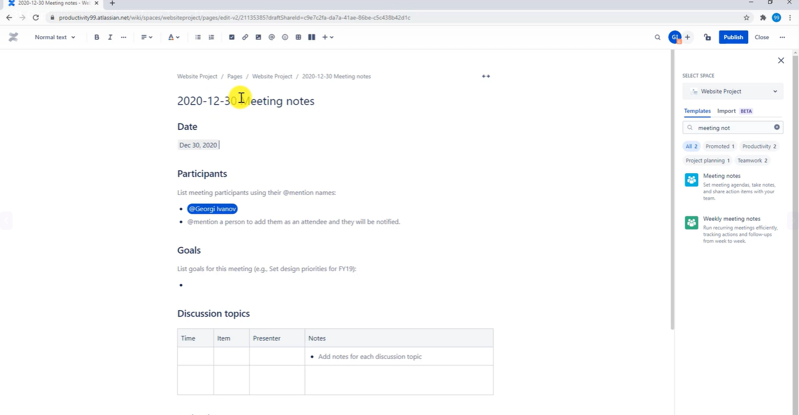

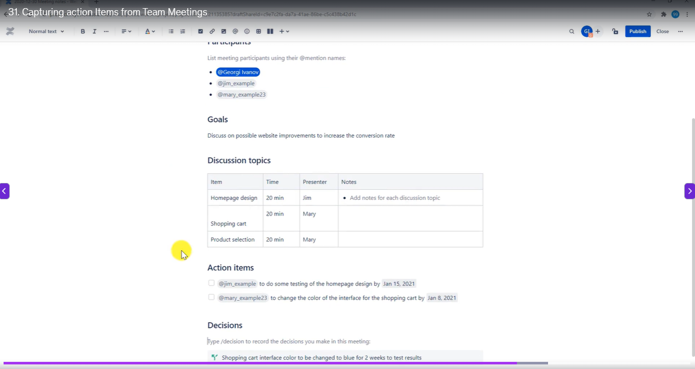