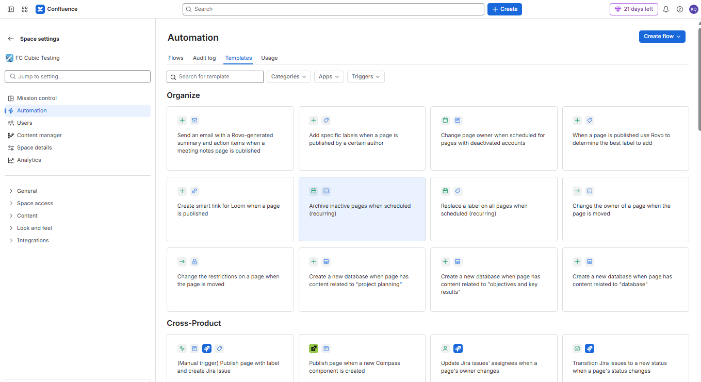
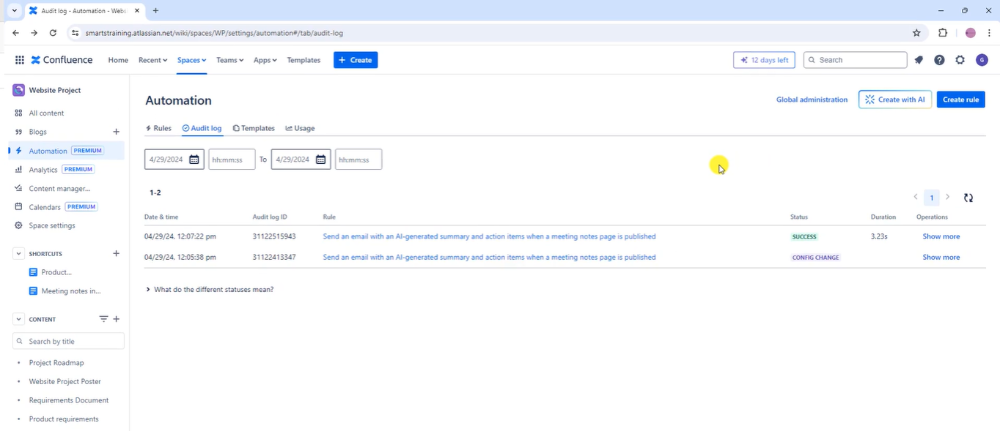
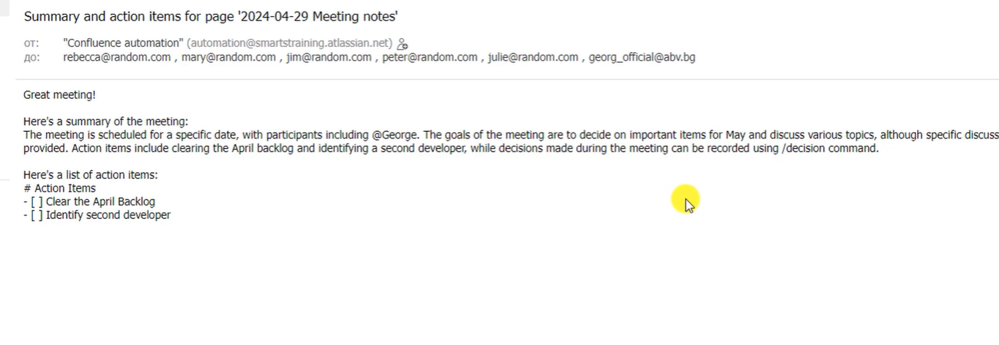
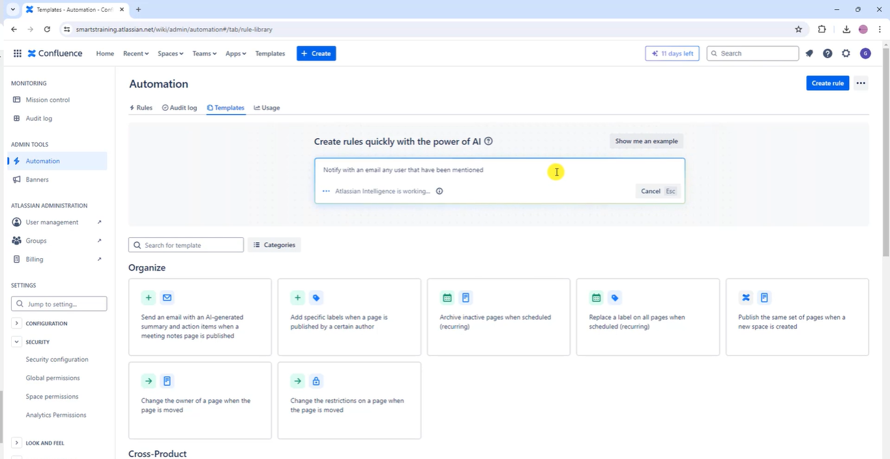
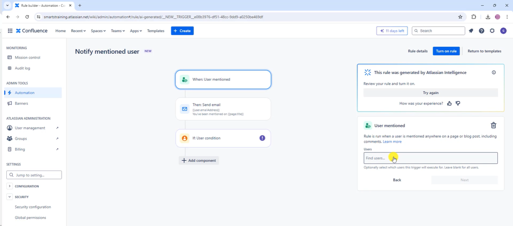
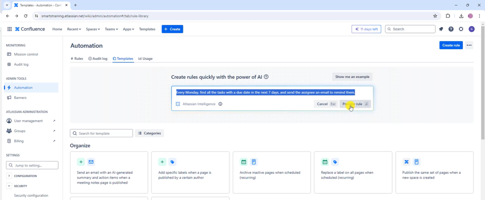
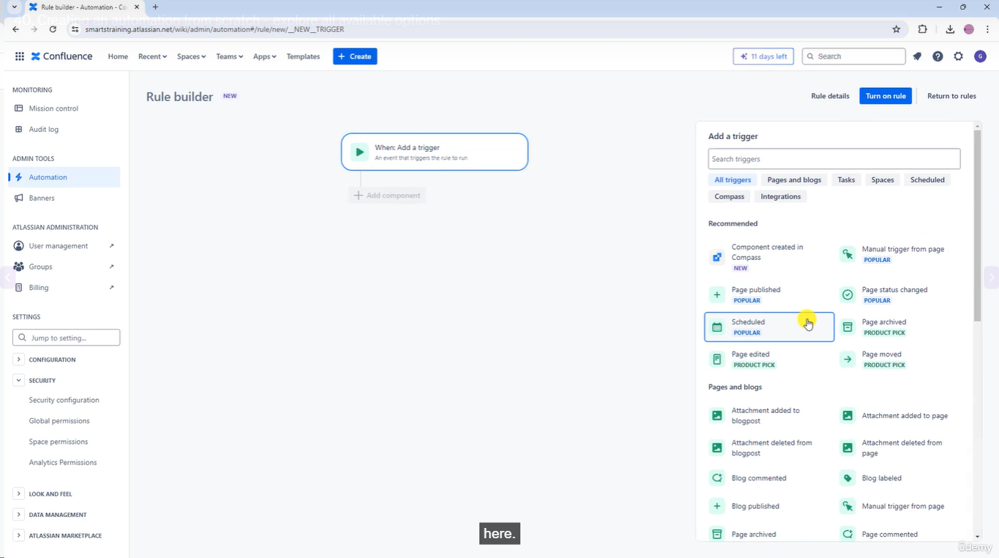
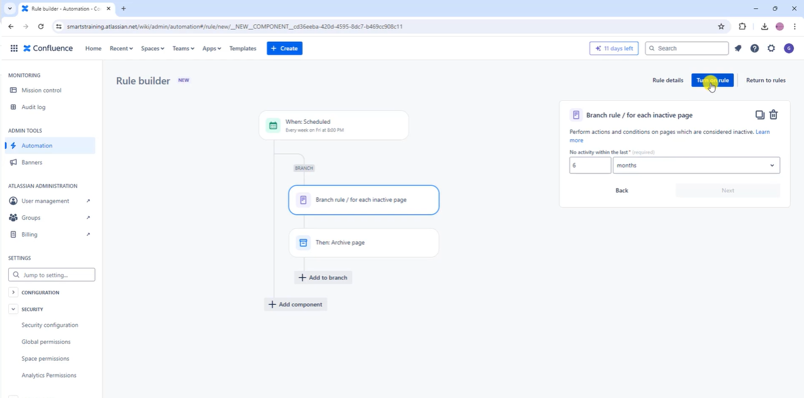
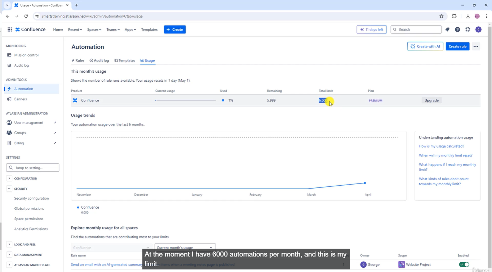

# Confluence Automations

## Creating first automation

> You can enable or disable the automation

## Create automation using AI

## You can create the rule from scratch

> It's a great way to learn what's available
> Another way to fully utilize to full potential Make a list of things that you do on a weekly basis for your work and then think if you can automate those tasks or not within confluence automation features

## Usage

> I don't see the point of manual work if you can automate it