# Confluence Space Administration

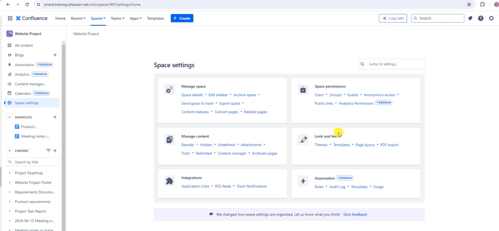

* Edit space details

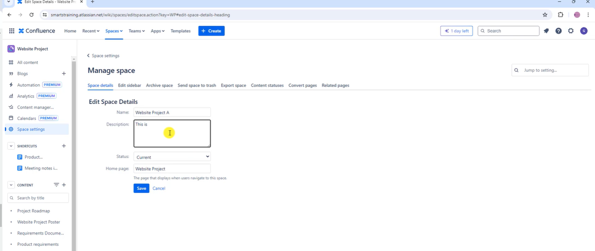

## Edit sidebar

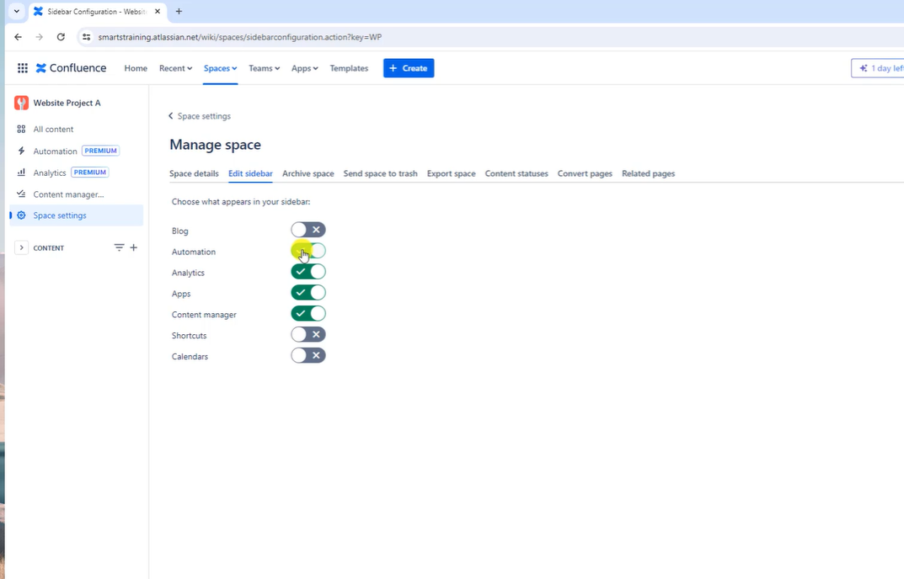

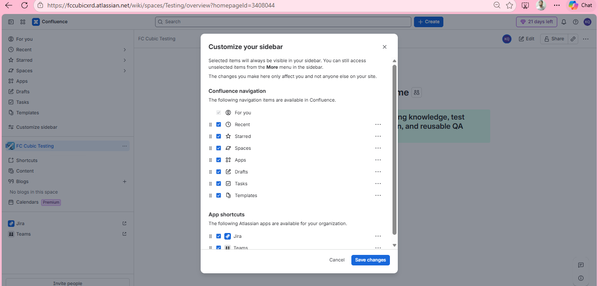

> Have things which team will be using on daily basis.

## Archive Space

* When number of space increases, it will help teams to find the most relevant space. you be able to access and restore the space later. It is not deletion

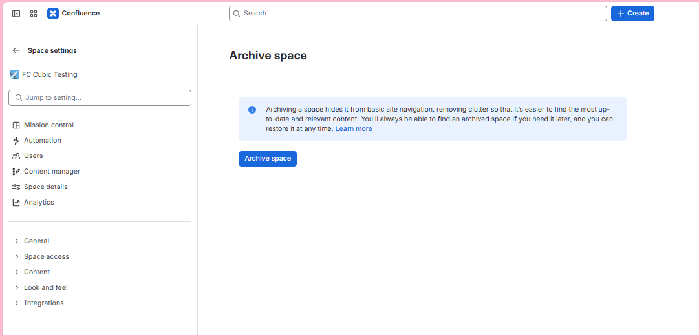

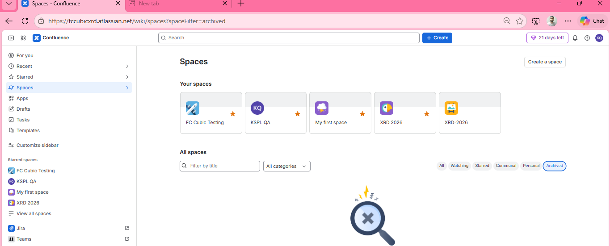

## Send space to trash

* It is basically deletion
* Only Admin will be able to restore

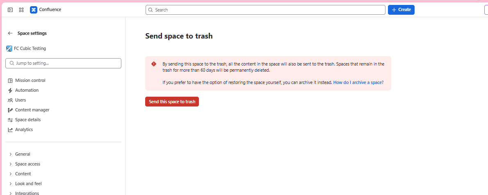

## Export the space

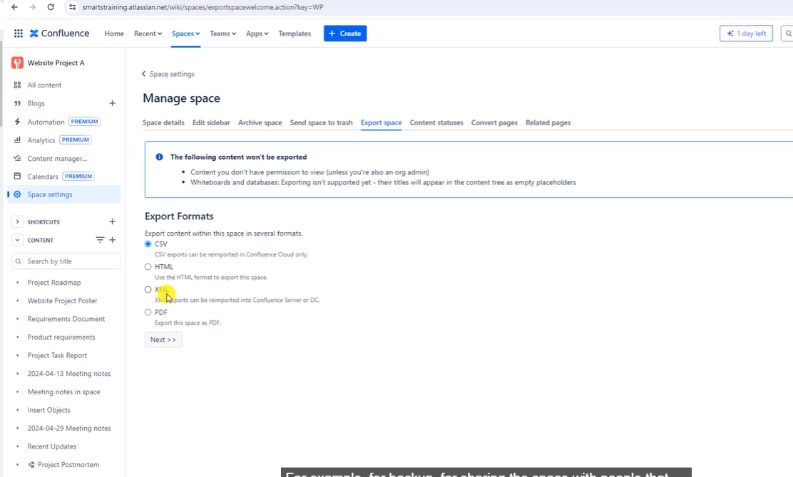

you can export individual pages also

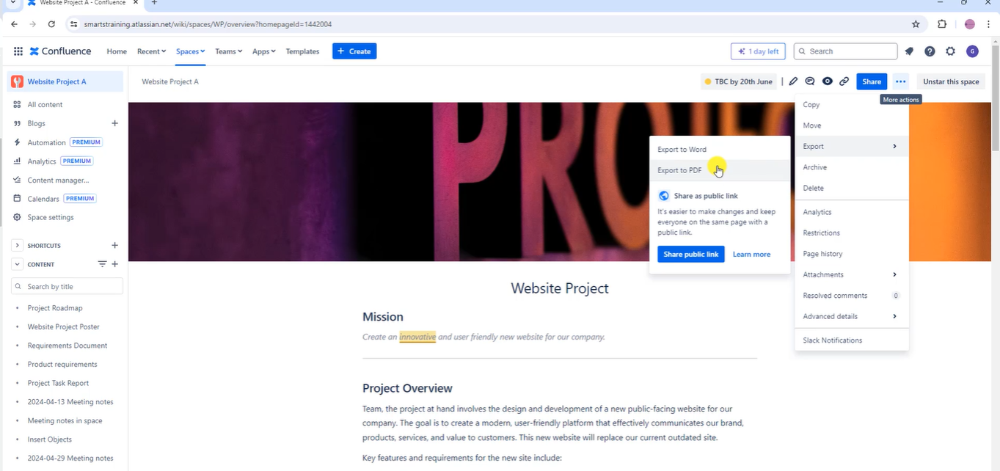

It's a great way if someone doesn't have access to confluence

* different way of exporting and limitations

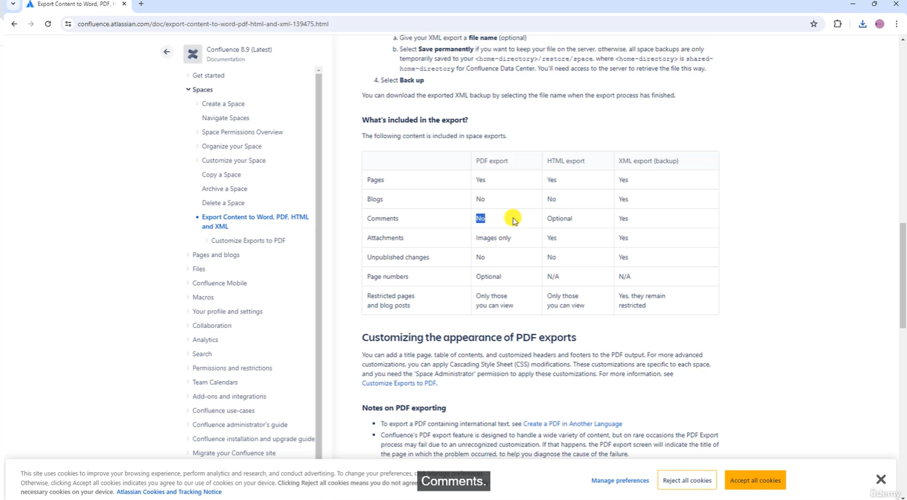

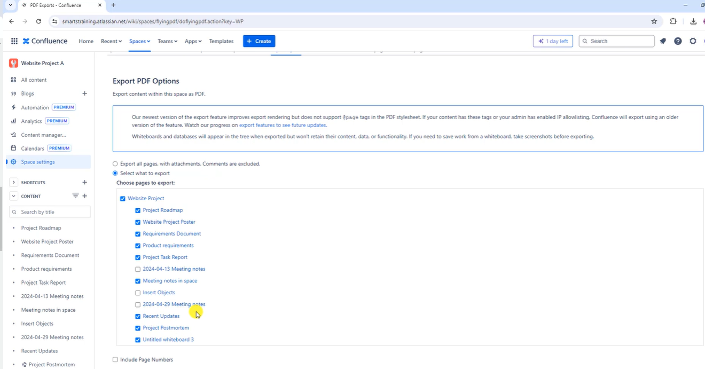

## Content statuses

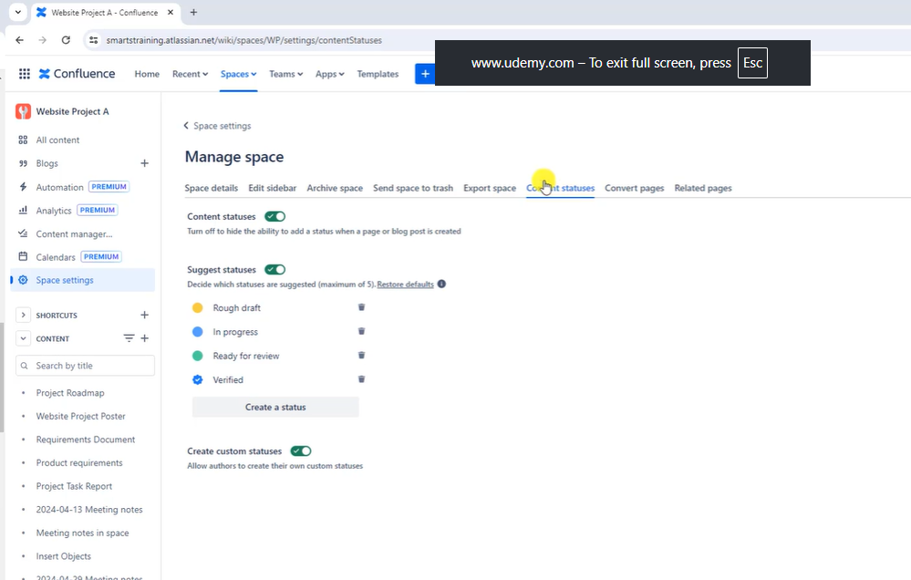

you can also disable custom page status

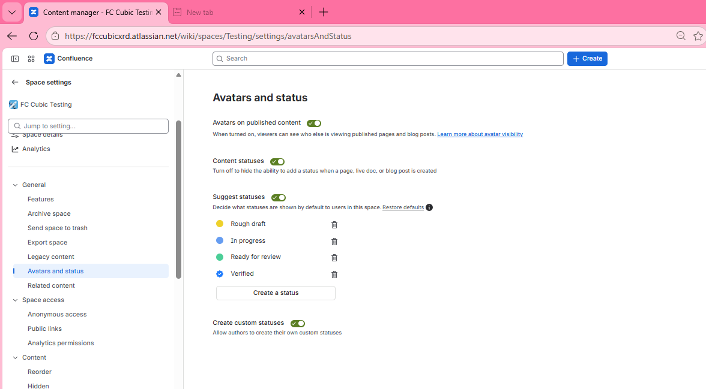

## Covert pages

for legacy pages and convert into new editor

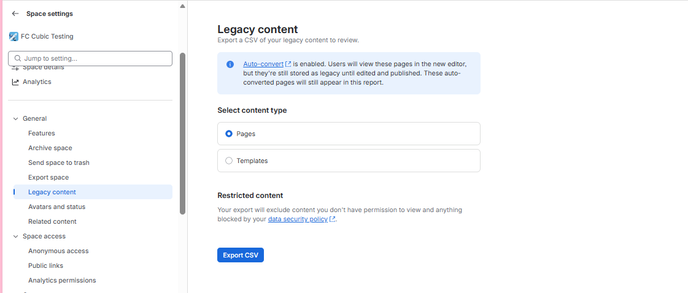

* Related content

if you are on a page it's going to generate some suggestion for them on realated pages

