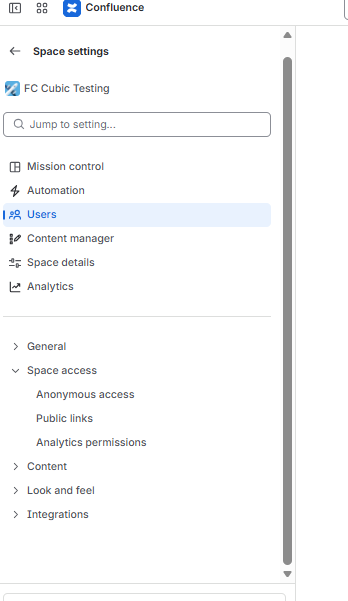
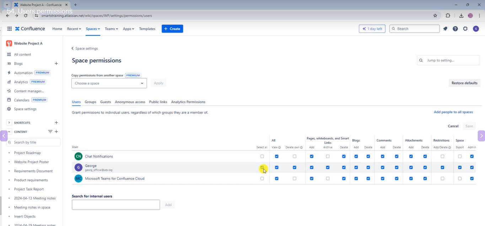
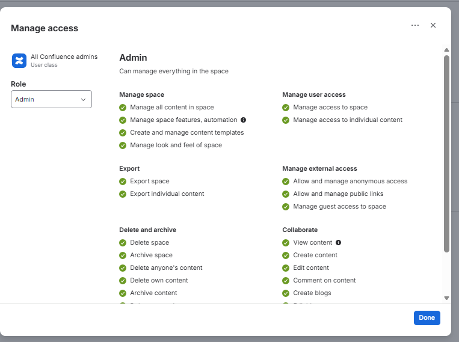
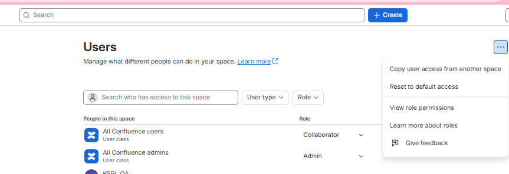
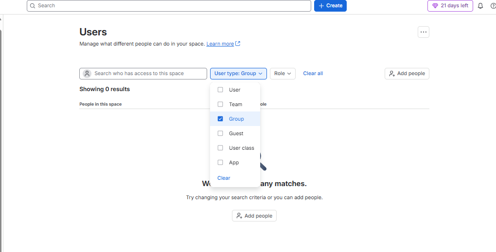
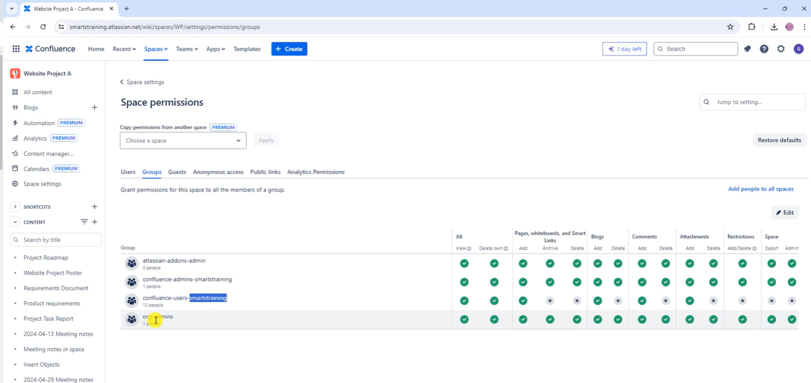
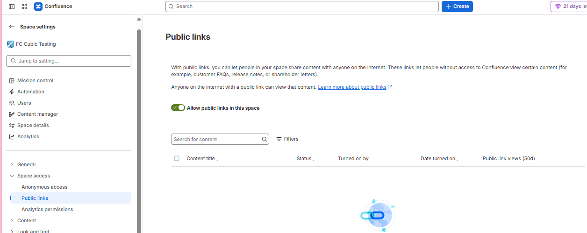
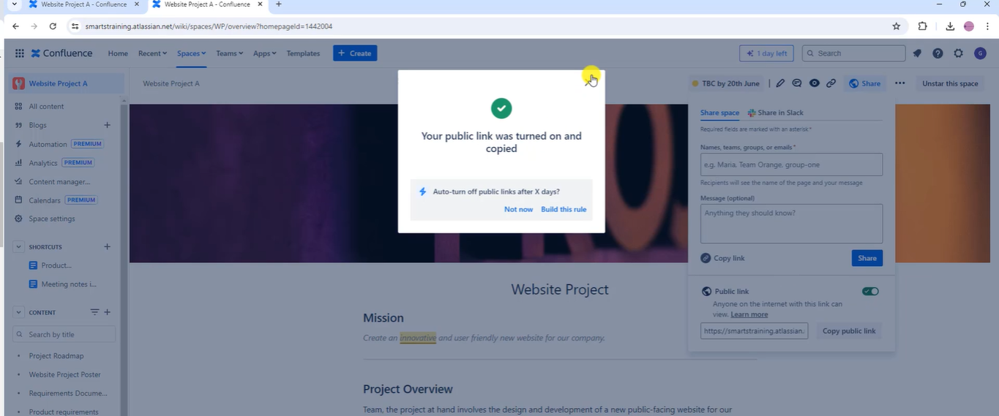
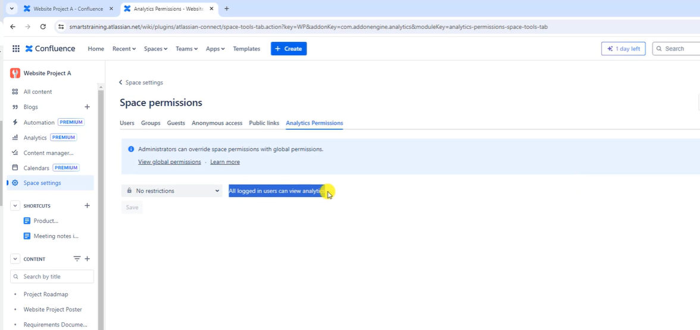
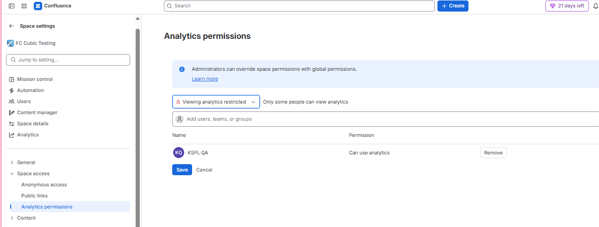

# Space Permissions

## Users Permissions

* Navigate to users

you can fully customize users can do and cannot do

you can also reset to default settings

## Groups

* you can use guests to partner with external people or other companies or bring other experts to the projects

## Public Links

with public links anyone with link can view it.

## Analytics permissions

> you can allow specific users to view analytics

