# Confluence Look and feel

> Reorder

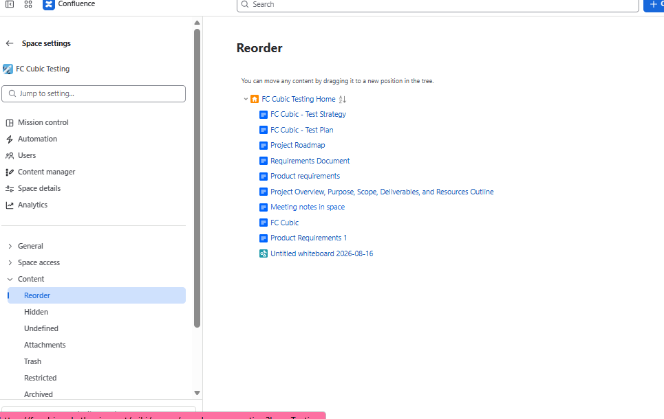

> Hidden

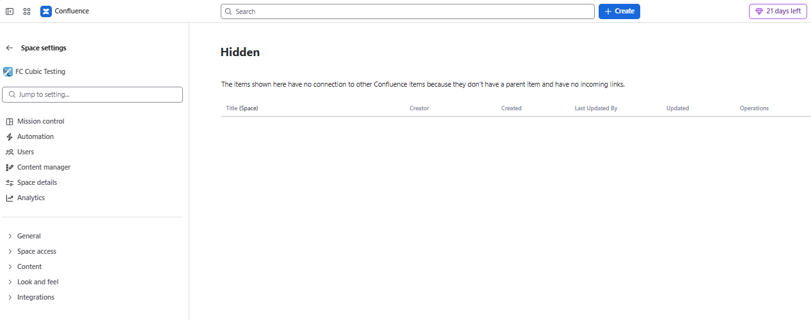

> Undefined

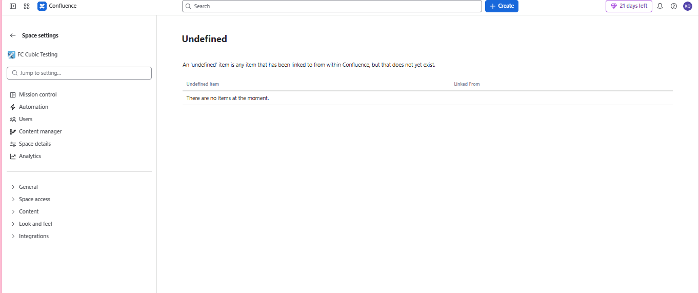

> Attachments - you can view all the attachments with a space

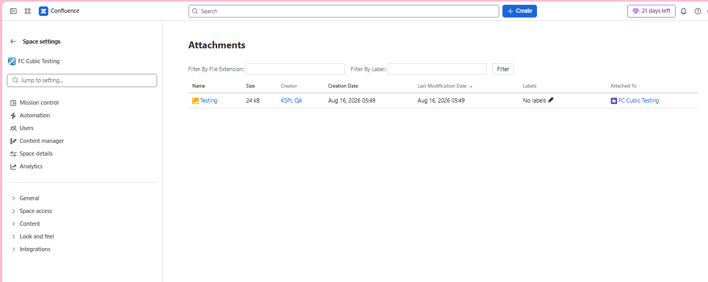

> Restricted

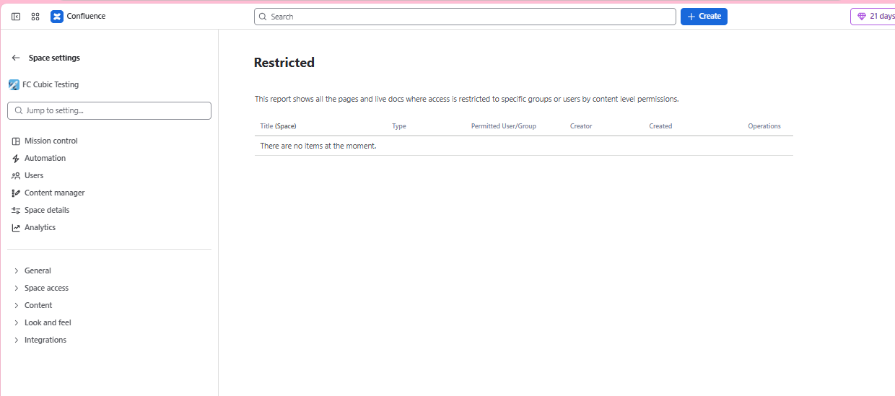

> Archived - it will show the Archived pages within the space

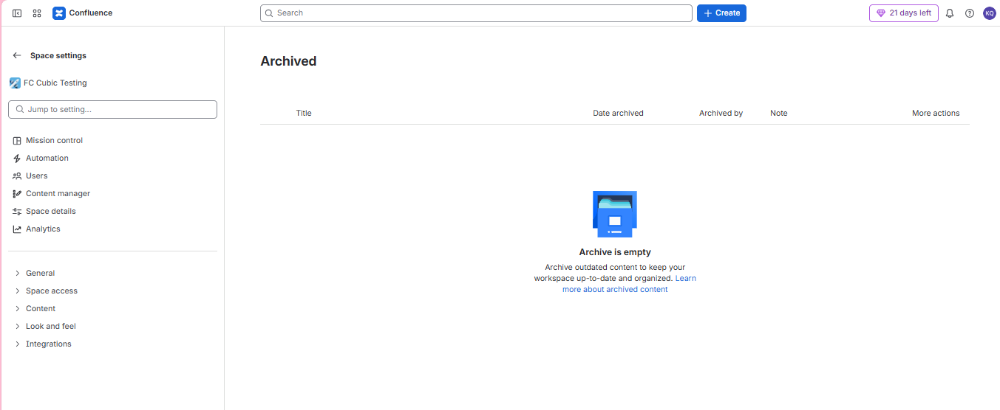

## Themes

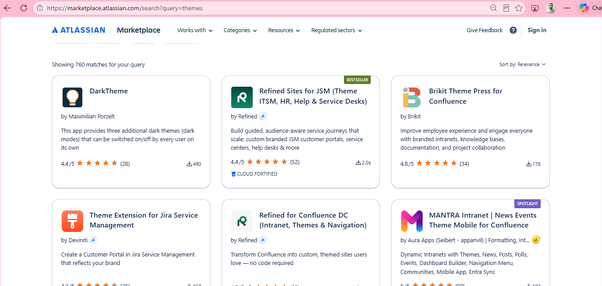

and you can install some themes. some are free and some are paid  
and once you have themes you will be able to apply

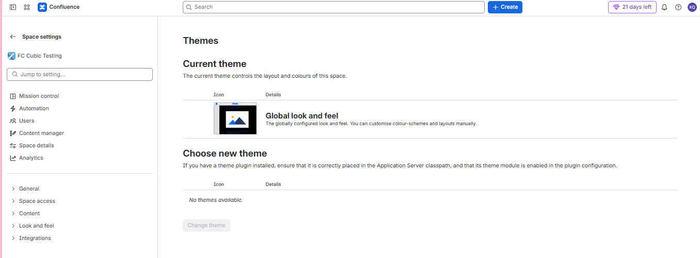

## Templates

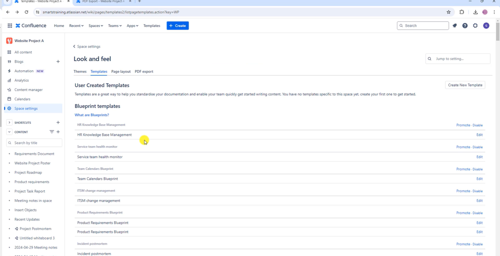

* you can also create a new template. It's pretty much like creating a new page

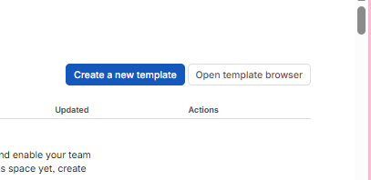

## Page Layout

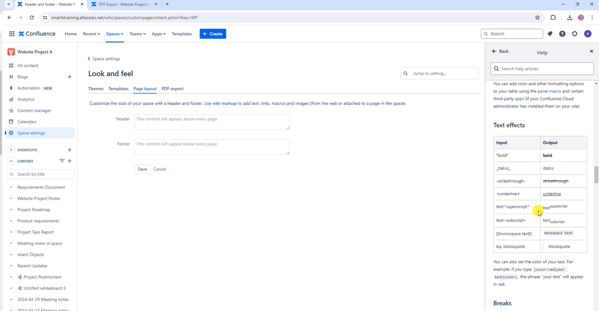

## PDF Exporting formatting

* you can customize from here

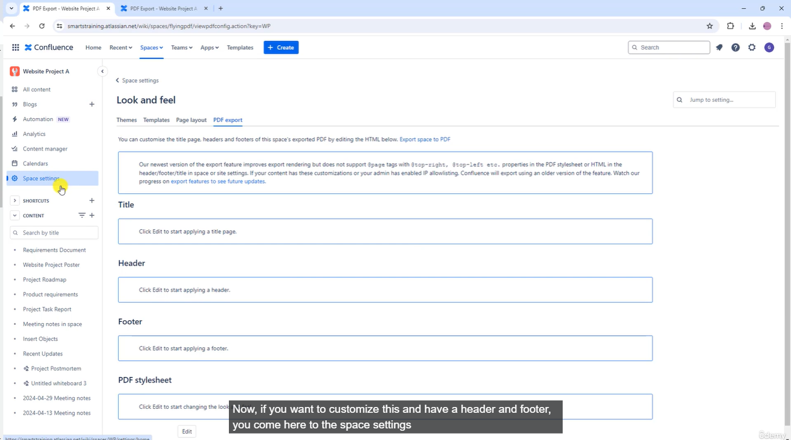

## Integrations

1. Jira

you can add jira

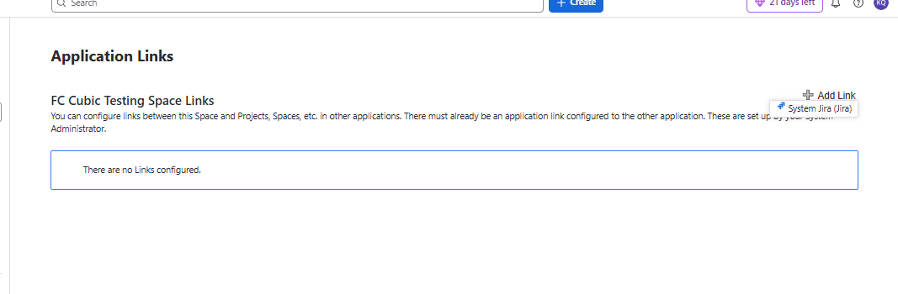

2. RSS Feeds

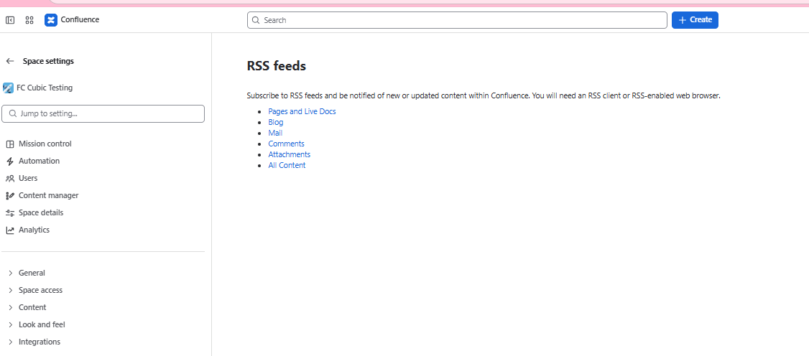

3. Slack Notifications

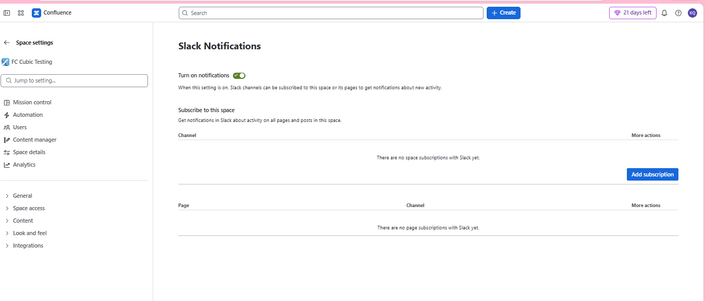

## Next Steps

> I really believe you now have skills to start using confluence for project management

